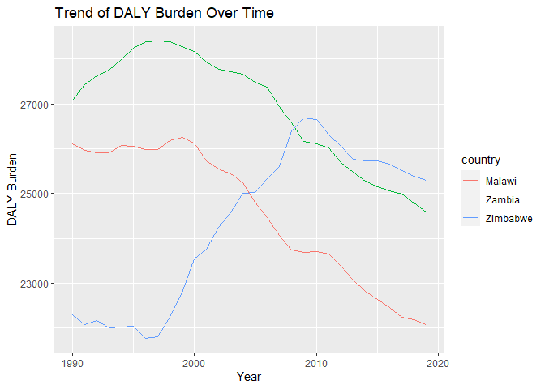

Global Disease Burden Analysis
================
Yollam Chilenje Manda

# Introduction

This document compares the Disability-Adjusted Life Year (DALY) diseases
burden for three countries: Malawi, Zimbabwe, and Zambia. We compare the
burden due to communicable, maternal, neonatal, and nutritional diseases
(CMNN), non-communicable diseases (NCDs), and overall disease burden for
these countries.

The source data is from the Institute for Health Metrics and Evaluation
(IHME) Global Burden of Disease (GBD) study.

# Communicable, Maternal, Neonatal, and Nutritional Disease Burden (CMNN)

    ## Rows: 8100 Columns: 4
    ## ── Column specification ────────────────────────────────────────────────────────
    ## Delimiter: ","
    ## chr (2): Entity, Code
    ## dbl (2): Year, DALYs (Disability-Adjusted Life Years) - Communicable, matern...
    ## 
    ## ℹ Use `spec()` to retrieve the full column specification for this data.
    ## ℹ Specify the column types or set `show_col_types = FALSE` to quiet this message.

## Table of Estimates for CMNN Burden Over Time

## Plot Showing Trends in CMNN Burden Over Time

## Summary of CMNN Burden Findings

Provide a brief analysis based on the data presented in the table and
chart. Highlight any significant findings or patterns. About 3
sentences.

# Non-Communicable Disease Burden (NCD)

    ## Rows: 8010 Columns: 4
    ## ── Column specification ────────────────────────────────────────────────────────
    ## Delimiter: ","
    ## chr (2): Entity, Code
    ## dbl (2): Year, DALYs (Disability-Adjusted Life Years) - Non-communicable dis...
    ## 
    ## ℹ Use `spec()` to retrieve the full column specification for this data.
    ## ℹ Specify the column types or set `show_col_types = FALSE` to quiet this message.

    ## # A tibble: 8,010 × 4
    ##    Entity      Code   Year DALYs (Disability-Adjusted Life Years) - Non-commun…¹
    ##    <chr>       <chr> <dbl>                                                 <dbl>
    ##  1 Afghanistan AFG    1990                                                41789.
    ##  2 Afghanistan AFG    1991                                                40756.
    ##  3 Afghanistan AFG    1992                                                40117.
    ##  4 Afghanistan AFG    1993                                                40402.
    ##  5 Afghanistan AFG    1994                                                40826.
    ##  6 Afghanistan AFG    1995                                                40780.
    ##  7 Afghanistan AFG    1996                                                40851.
    ##  8 Afghanistan AFG    1997                                                41017.
    ##  9 Afghanistan AFG    1998                                                41134.
    ## 10 Afghanistan AFG    1999                                                41298.
    ## # ℹ 8,000 more rows
    ## # ℹ abbreviated name:
    ## #   ¹​`DALYs (Disability-Adjusted Life Years) - Non-communicable diseases - Sex: Both - Age: Age-standardized (Rate)`

## Table of Estimates for NCD Burden Over Time

    ## <pillar>
    ## <tibble[,4]>                 
    ## # A tibble: 90 × 4           
    ##    country code   year   daly
    ##    <chr>   <chr> <dbl>  <dbl>
    ##  1 Malawi  MWI    1990 26111.
    ##  2 Malawi  MWI    1991 25959.
    ##  3 Malawi  MWI    1992 25917.
    ##  4 Malawi  MWI    1993 25907.
    ##  5 Malawi  MWI    1994 26069.
    ##  6 Malawi  MWI    1995 26047.
    ##  7 Malawi  MWI    1996 25975.
    ##  8 Malawi  MWI    1997 25978.
    ##  9 Malawi  MWI    1998 26173.
    ## 10 Malawi  MWI    1999 26245.
    ## # ℹ 80 more rows

    ## # A tibble: 90 × 5
    ##    code   year Malawi Zambia Zimbabwe
    ##    <chr> <dbl>  <dbl>  <dbl>    <dbl>
    ##  1 MWI    1990 26111.     NA       NA
    ##  2 MWI    1991 25959.     NA       NA
    ##  3 MWI    1992 25917.     NA       NA
    ##  4 MWI    1993 25907.     NA       NA
    ##  5 MWI    1994 26069.     NA       NA
    ##  6 MWI    1995 26047.     NA       NA
    ##  7 MWI    1996 25975.     NA       NA
    ##  8 MWI    1997 25978.     NA       NA
    ##  9 MWI    1998 26173.     NA       NA
    ## 10 MWI    1999 26245.     NA       NA
    ## # ℹ 80 more rows

<table>
<caption>
DALY Burden Over Time for Three Countries
</caption>
<thead>
<tr>
<th style="text-align:left;">
code
</th>
<th style="text-align:right;">
year
</th>
<th style="text-align:right;">
Malawi
</th>
<th style="text-align:right;">
Zambia
</th>
<th style="text-align:right;">
Zimbabwe
</th>
</tr>
</thead>
<tbody>
<tr>
<td style="text-align:left;">
MWI
</td>
<td style="text-align:right;">
1990
</td>
<td style="text-align:right;">
26110.73
</td>
<td style="text-align:right;">
NA
</td>
<td style="text-align:right;">
NA
</td>
</tr>
<tr>
<td style="text-align:left;">
MWI
</td>
<td style="text-align:right;">
1991
</td>
<td style="text-align:right;">
25958.66
</td>
<td style="text-align:right;">
NA
</td>
<td style="text-align:right;">
NA
</td>
</tr>
<tr>
<td style="text-align:left;">
MWI
</td>
<td style="text-align:right;">
1992
</td>
<td style="text-align:right;">
25916.86
</td>
<td style="text-align:right;">
NA
</td>
<td style="text-align:right;">
NA
</td>
</tr>
<tr>
<td style="text-align:left;">
MWI
</td>
<td style="text-align:right;">
1993
</td>
<td style="text-align:right;">
25906.62
</td>
<td style="text-align:right;">
NA
</td>
<td style="text-align:right;">
NA
</td>
</tr>
<tr>
<td style="text-align:left;">
MWI
</td>
<td style="text-align:right;">
1994
</td>
<td style="text-align:right;">
26069.36
</td>
<td style="text-align:right;">
NA
</td>
<td style="text-align:right;">
NA
</td>
</tr>
<tr>
<td style="text-align:left;">
MWI
</td>
<td style="text-align:right;">
1995
</td>
<td style="text-align:right;">
26047.46
</td>
<td style="text-align:right;">
NA
</td>
<td style="text-align:right;">
NA
</td>
</tr>
<tr>
<td style="text-align:left;">
MWI
</td>
<td style="text-align:right;">
1996
</td>
<td style="text-align:right;">
25974.52
</td>
<td style="text-align:right;">
NA
</td>
<td style="text-align:right;">
NA
</td>
</tr>
<tr>
<td style="text-align:left;">
MWI
</td>
<td style="text-align:right;">
1997
</td>
<td style="text-align:right;">
25977.72
</td>
<td style="text-align:right;">
NA
</td>
<td style="text-align:right;">
NA
</td>
</tr>
<tr>
<td style="text-align:left;">
MWI
</td>
<td style="text-align:right;">
1998
</td>
<td style="text-align:right;">
26173.10
</td>
<td style="text-align:right;">
NA
</td>
<td style="text-align:right;">
NA
</td>
</tr>
<tr>
<td style="text-align:left;">
MWI
</td>
<td style="text-align:right;">
1999
</td>
<td style="text-align:right;">
26245.34
</td>
<td style="text-align:right;">
NA
</td>
<td style="text-align:right;">
NA
</td>
</tr>
<tr>
<td style="text-align:left;">
MWI
</td>
<td style="text-align:right;">
2000
</td>
<td style="text-align:right;">
26124.75
</td>
<td style="text-align:right;">
NA
</td>
<td style="text-align:right;">
NA
</td>
</tr>
<tr>
<td style="text-align:left;">
MWI
</td>
<td style="text-align:right;">
2001
</td>
<td style="text-align:right;">
25721.95
</td>
<td style="text-align:right;">
NA
</td>
<td style="text-align:right;">
NA
</td>
</tr>
<tr>
<td style="text-align:left;">
MWI
</td>
<td style="text-align:right;">
2002
</td>
<td style="text-align:right;">
25552.50
</td>
<td style="text-align:right;">
NA
</td>
<td style="text-align:right;">
NA
</td>
</tr>
<tr>
<td style="text-align:left;">
MWI
</td>
<td style="text-align:right;">
2003
</td>
<td style="text-align:right;">
25440.97
</td>
<td style="text-align:right;">
NA
</td>
<td style="text-align:right;">
NA
</td>
</tr>
<tr>
<td style="text-align:left;">
MWI
</td>
<td style="text-align:right;">
2004
</td>
<td style="text-align:right;">
25237.83
</td>
<td style="text-align:right;">
NA
</td>
<td style="text-align:right;">
NA
</td>
</tr>
<tr>
<td style="text-align:left;">
MWI
</td>
<td style="text-align:right;">
2005
</td>
<td style="text-align:right;">
24813.51
</td>
<td style="text-align:right;">
NA
</td>
<td style="text-align:right;">
NA
</td>
</tr>
<tr>
<td style="text-align:left;">
MWI
</td>
<td style="text-align:right;">
2006
</td>
<td style="text-align:right;">
24457.66
</td>
<td style="text-align:right;">
NA
</td>
<td style="text-align:right;">
NA
</td>
</tr>
<tr>
<td style="text-align:left;">
MWI
</td>
<td style="text-align:right;">
2007
</td>
<td style="text-align:right;">
24066.02
</td>
<td style="text-align:right;">
NA
</td>
<td style="text-align:right;">
NA
</td>
</tr>
<tr>
<td style="text-align:left;">
MWI
</td>
<td style="text-align:right;">
2008
</td>
<td style="text-align:right;">
23745.79
</td>
<td style="text-align:right;">
NA
</td>
<td style="text-align:right;">
NA
</td>
</tr>
<tr>
<td style="text-align:left;">
MWI
</td>
<td style="text-align:right;">
2009
</td>
<td style="text-align:right;">
23676.73
</td>
<td style="text-align:right;">
NA
</td>
<td style="text-align:right;">
NA
</td>
</tr>
<tr>
<td style="text-align:left;">
MWI
</td>
<td style="text-align:right;">
2010
</td>
<td style="text-align:right;">
23695.54
</td>
<td style="text-align:right;">
NA
</td>
<td style="text-align:right;">
NA
</td>
</tr>
<tr>
<td style="text-align:left;">
MWI
</td>
<td style="text-align:right;">
2011
</td>
<td style="text-align:right;">
23639.66
</td>
<td style="text-align:right;">
NA
</td>
<td style="text-align:right;">
NA
</td>
</tr>
<tr>
<td style="text-align:left;">
MWI
</td>
<td style="text-align:right;">
2012
</td>
<td style="text-align:right;">
23378.73
</td>
<td style="text-align:right;">
NA
</td>
<td style="text-align:right;">
NA
</td>
</tr>
<tr>
<td style="text-align:left;">
MWI
</td>
<td style="text-align:right;">
2013
</td>
<td style="text-align:right;">
23074.74
</td>
<td style="text-align:right;">
NA
</td>
<td style="text-align:right;">
NA
</td>
</tr>
<tr>
<td style="text-align:left;">
MWI
</td>
<td style="text-align:right;">
2014
</td>
<td style="text-align:right;">
22817.03
</td>
<td style="text-align:right;">
NA
</td>
<td style="text-align:right;">
NA
</td>
</tr>
<tr>
<td style="text-align:left;">
MWI
</td>
<td style="text-align:right;">
2015
</td>
<td style="text-align:right;">
22639.25
</td>
<td style="text-align:right;">
NA
</td>
<td style="text-align:right;">
NA
</td>
</tr>
<tr>
<td style="text-align:left;">
MWI
</td>
<td style="text-align:right;">
2016
</td>
<td style="text-align:right;">
22459.70
</td>
<td style="text-align:right;">
NA
</td>
<td style="text-align:right;">
NA
</td>
</tr>
<tr>
<td style="text-align:left;">
MWI
</td>
<td style="text-align:right;">
2017
</td>
<td style="text-align:right;">
22233.32
</td>
<td style="text-align:right;">
NA
</td>
<td style="text-align:right;">
NA
</td>
</tr>
<tr>
<td style="text-align:left;">
MWI
</td>
<td style="text-align:right;">
2018
</td>
<td style="text-align:right;">
22179.48
</td>
<td style="text-align:right;">
NA
</td>
<td style="text-align:right;">
NA
</td>
</tr>
<tr>
<td style="text-align:left;">
MWI
</td>
<td style="text-align:right;">
2019
</td>
<td style="text-align:right;">
22082.07
</td>
<td style="text-align:right;">
NA
</td>
<td style="text-align:right;">
NA
</td>
</tr>
<tr>
<td style="text-align:left;">
ZMB
</td>
<td style="text-align:right;">
1990
</td>
<td style="text-align:right;">
NA
</td>
<td style="text-align:right;">
27086.05
</td>
<td style="text-align:right;">
NA
</td>
</tr>
<tr>
<td style="text-align:left;">
ZMB
</td>
<td style="text-align:right;">
1991
</td>
<td style="text-align:right;">
NA
</td>
<td style="text-align:right;">
27421.30
</td>
<td style="text-align:right;">
NA
</td>
</tr>
<tr>
<td style="text-align:left;">
ZMB
</td>
<td style="text-align:right;">
1992
</td>
<td style="text-align:right;">
NA
</td>
<td style="text-align:right;">
27620.82
</td>
<td style="text-align:right;">
NA
</td>
</tr>
<tr>
<td style="text-align:left;">
ZMB
</td>
<td style="text-align:right;">
1993
</td>
<td style="text-align:right;">
NA
</td>
<td style="text-align:right;">
27754.82
</td>
<td style="text-align:right;">
NA
</td>
</tr>
<tr>
<td style="text-align:left;">
ZMB
</td>
<td style="text-align:right;">
1994
</td>
<td style="text-align:right;">
NA
</td>
<td style="text-align:right;">
27985.57
</td>
<td style="text-align:right;">
NA
</td>
</tr>
<tr>
<td style="text-align:left;">
ZMB
</td>
<td style="text-align:right;">
1995
</td>
<td style="text-align:right;">
NA
</td>
<td style="text-align:right;">
28243.59
</td>
<td style="text-align:right;">
NA
</td>
</tr>
<tr>
<td style="text-align:left;">
ZMB
</td>
<td style="text-align:right;">
1996
</td>
<td style="text-align:right;">
NA
</td>
<td style="text-align:right;">
28384.78
</td>
<td style="text-align:right;">
NA
</td>
</tr>
<tr>
<td style="text-align:left;">
ZMB
</td>
<td style="text-align:right;">
1997
</td>
<td style="text-align:right;">
NA
</td>
<td style="text-align:right;">
28397.43
</td>
<td style="text-align:right;">
NA
</td>
</tr>
<tr>
<td style="text-align:left;">
ZMB
</td>
<td style="text-align:right;">
1998
</td>
<td style="text-align:right;">
NA
</td>
<td style="text-align:right;">
28385.64
</td>
<td style="text-align:right;">
NA
</td>
</tr>
<tr>
<td style="text-align:left;">
ZMB
</td>
<td style="text-align:right;">
1999
</td>
<td style="text-align:right;">
NA
</td>
<td style="text-align:right;">
28278.73
</td>
<td style="text-align:right;">
NA
</td>
</tr>
<tr>
<td style="text-align:left;">
ZMB
</td>
<td style="text-align:right;">
2000
</td>
<td style="text-align:right;">
NA
</td>
<td style="text-align:right;">
28175.35
</td>
<td style="text-align:right;">
NA
</td>
</tr>
<tr>
<td style="text-align:left;">
ZMB
</td>
<td style="text-align:right;">
2001
</td>
<td style="text-align:right;">
NA
</td>
<td style="text-align:right;">
27927.86
</td>
<td style="text-align:right;">
NA
</td>
</tr>
<tr>
<td style="text-align:left;">
ZMB
</td>
<td style="text-align:right;">
2002
</td>
<td style="text-align:right;">
NA
</td>
<td style="text-align:right;">
27779.03
</td>
<td style="text-align:right;">
NA
</td>
</tr>
<tr>
<td style="text-align:left;">
ZMB
</td>
<td style="text-align:right;">
2003
</td>
<td style="text-align:right;">
NA
</td>
<td style="text-align:right;">
27716.50
</td>
<td style="text-align:right;">
NA
</td>
</tr>
<tr>
<td style="text-align:left;">
ZMB
</td>
<td style="text-align:right;">
2004
</td>
<td style="text-align:right;">
NA
</td>
<td style="text-align:right;">
27662.22
</td>
<td style="text-align:right;">
NA
</td>
</tr>
<tr>
<td style="text-align:left;">
ZMB
</td>
<td style="text-align:right;">
2005
</td>
<td style="text-align:right;">
NA
</td>
<td style="text-align:right;">
27477.66
</td>
<td style="text-align:right;">
NA
</td>
</tr>
<tr>
<td style="text-align:left;">
ZMB
</td>
<td style="text-align:right;">
2006
</td>
<td style="text-align:right;">
NA
</td>
<td style="text-align:right;">
27374.11
</td>
<td style="text-align:right;">
NA
</td>
</tr>
<tr>
<td style="text-align:left;">
ZMB
</td>
<td style="text-align:right;">
2007
</td>
<td style="text-align:right;">
NA
</td>
<td style="text-align:right;">
26937.71
</td>
<td style="text-align:right;">
NA
</td>
</tr>
<tr>
<td style="text-align:left;">
ZMB
</td>
<td style="text-align:right;">
2008
</td>
<td style="text-align:right;">
NA
</td>
<td style="text-align:right;">
26571.64
</td>
<td style="text-align:right;">
NA
</td>
</tr>
<tr>
<td style="text-align:left;">
ZMB
</td>
<td style="text-align:right;">
2009
</td>
<td style="text-align:right;">
NA
</td>
<td style="text-align:right;">
26159.99
</td>
<td style="text-align:right;">
NA
</td>
</tr>
<tr>
<td style="text-align:left;">
ZMB
</td>
<td style="text-align:right;">
2010
</td>
<td style="text-align:right;">
NA
</td>
<td style="text-align:right;">
26106.24
</td>
<td style="text-align:right;">
NA
</td>
</tr>
<tr>
<td style="text-align:left;">
ZMB
</td>
<td style="text-align:right;">
2011
</td>
<td style="text-align:right;">
NA
</td>
<td style="text-align:right;">
26019.12
</td>
<td style="text-align:right;">
NA
</td>
</tr>
<tr>
<td style="text-align:left;">
ZMB
</td>
<td style="text-align:right;">
2012
</td>
<td style="text-align:right;">
NA
</td>
<td style="text-align:right;">
25687.59
</td>
<td style="text-align:right;">
NA
</td>
</tr>
<tr>
<td style="text-align:left;">
ZMB
</td>
<td style="text-align:right;">
2013
</td>
<td style="text-align:right;">
NA
</td>
<td style="text-align:right;">
25477.24
</td>
<td style="text-align:right;">
NA
</td>
</tr>
<tr>
<td style="text-align:left;">
ZMB
</td>
<td style="text-align:right;">
2014
</td>
<td style="text-align:right;">
NA
</td>
<td style="text-align:right;">
25270.56
</td>
<td style="text-align:right;">
NA
</td>
</tr>
<tr>
<td style="text-align:left;">
ZMB
</td>
<td style="text-align:right;">
2015
</td>
<td style="text-align:right;">
NA
</td>
<td style="text-align:right;">
25141.08
</td>
<td style="text-align:right;">
NA
</td>
</tr>
<tr>
<td style="text-align:left;">
ZMB
</td>
<td style="text-align:right;">
2016
</td>
<td style="text-align:right;">
NA
</td>
<td style="text-align:right;">
25063.91
</td>
<td style="text-align:right;">
NA
</td>
</tr>
<tr>
<td style="text-align:left;">
ZMB
</td>
<td style="text-align:right;">
2017
</td>
<td style="text-align:right;">
NA
</td>
<td style="text-align:right;">
24993.33
</td>
<td style="text-align:right;">
NA
</td>
</tr>
<tr>
<td style="text-align:left;">
ZMB
</td>
<td style="text-align:right;">
2018
</td>
<td style="text-align:right;">
NA
</td>
<td style="text-align:right;">
24784.61
</td>
<td style="text-align:right;">
NA
</td>
</tr>
<tr>
<td style="text-align:left;">
ZMB
</td>
<td style="text-align:right;">
2019
</td>
<td style="text-align:right;">
NA
</td>
<td style="text-align:right;">
24596.16
</td>
<td style="text-align:right;">
NA
</td>
</tr>
<tr>
<td style="text-align:left;">
ZWE
</td>
<td style="text-align:right;">
1990
</td>
<td style="text-align:right;">
NA
</td>
<td style="text-align:right;">
NA
</td>
<td style="text-align:right;">
22297.56
</td>
</tr>
<tr>
<td style="text-align:left;">
ZWE
</td>
<td style="text-align:right;">
1991
</td>
<td style="text-align:right;">
NA
</td>
<td style="text-align:right;">
NA
</td>
<td style="text-align:right;">
22078.26
</td>
</tr>
<tr>
<td style="text-align:left;">
ZWE
</td>
<td style="text-align:right;">
1992
</td>
<td style="text-align:right;">
NA
</td>
<td style="text-align:right;">
NA
</td>
<td style="text-align:right;">
22174.33
</td>
</tr>
<tr>
<td style="text-align:left;">
ZWE
</td>
<td style="text-align:right;">
1993
</td>
<td style="text-align:right;">
NA
</td>
<td style="text-align:right;">
NA
</td>
<td style="text-align:right;">
21996.56
</td>
</tr>
<tr>
<td style="text-align:left;">
ZWE
</td>
<td style="text-align:right;">
1994
</td>
<td style="text-align:right;">
NA
</td>
<td style="text-align:right;">
NA
</td>
<td style="text-align:right;">
22021.09
</td>
</tr>
<tr>
<td style="text-align:left;">
ZWE
</td>
<td style="text-align:right;">
1995
</td>
<td style="text-align:right;">
NA
</td>
<td style="text-align:right;">
NA
</td>
<td style="text-align:right;">
22042.96
</td>
</tr>
<tr>
<td style="text-align:left;">
ZWE
</td>
<td style="text-align:right;">
1996
</td>
<td style="text-align:right;">
NA
</td>
<td style="text-align:right;">
NA
</td>
<td style="text-align:right;">
21774.05
</td>
</tr>
<tr>
<td style="text-align:left;">
ZWE
</td>
<td style="text-align:right;">
1997
</td>
<td style="text-align:right;">
NA
</td>
<td style="text-align:right;">
NA
</td>
<td style="text-align:right;">
21796.51
</td>
</tr>
<tr>
<td style="text-align:left;">
ZWE
</td>
<td style="text-align:right;">
1998
</td>
<td style="text-align:right;">
NA
</td>
<td style="text-align:right;">
NA
</td>
<td style="text-align:right;">
22245.64
</td>
</tr>
<tr>
<td style="text-align:left;">
ZWE
</td>
<td style="text-align:right;">
1999
</td>
<td style="text-align:right;">
NA
</td>
<td style="text-align:right;">
NA
</td>
<td style="text-align:right;">
22772.21
</td>
</tr>
<tr>
<td style="text-align:left;">
ZWE
</td>
<td style="text-align:right;">
2000
</td>
<td style="text-align:right;">
NA
</td>
<td style="text-align:right;">
NA
</td>
<td style="text-align:right;">
23533.63
</td>
</tr>
<tr>
<td style="text-align:left;">
ZWE
</td>
<td style="text-align:right;">
2001
</td>
<td style="text-align:right;">
NA
</td>
<td style="text-align:right;">
NA
</td>
<td style="text-align:right;">
23763.29
</td>
</tr>
<tr>
<td style="text-align:left;">
ZWE
</td>
<td style="text-align:right;">
2002
</td>
<td style="text-align:right;">
NA
</td>
<td style="text-align:right;">
NA
</td>
<td style="text-align:right;">
24243.05
</td>
</tr>
<tr>
<td style="text-align:left;">
ZWE
</td>
<td style="text-align:right;">
2003
</td>
<td style="text-align:right;">
NA
</td>
<td style="text-align:right;">
NA
</td>
<td style="text-align:right;">
24570.26
</td>
</tr>
<tr>
<td style="text-align:left;">
ZWE
</td>
<td style="text-align:right;">
2004
</td>
<td style="text-align:right;">
NA
</td>
<td style="text-align:right;">
NA
</td>
<td style="text-align:right;">
25012.97
</td>
</tr>
<tr>
<td style="text-align:left;">
ZWE
</td>
<td style="text-align:right;">
2005
</td>
<td style="text-align:right;">
NA
</td>
<td style="text-align:right;">
NA
</td>
<td style="text-align:right;">
25031.35
</td>
</tr>
<tr>
<td style="text-align:left;">
ZWE
</td>
<td style="text-align:right;">
2006
</td>
<td style="text-align:right;">
NA
</td>
<td style="text-align:right;">
NA
</td>
<td style="text-align:right;">
25326.42
</td>
</tr>
<tr>
<td style="text-align:left;">
ZWE
</td>
<td style="text-align:right;">
2007
</td>
<td style="text-align:right;">
NA
</td>
<td style="text-align:right;">
NA
</td>
<td style="text-align:right;">
25598.20
</td>
</tr>
<tr>
<td style="text-align:left;">
ZWE
</td>
<td style="text-align:right;">
2008
</td>
<td style="text-align:right;">
NA
</td>
<td style="text-align:right;">
NA
</td>
<td style="text-align:right;">
26396.70
</td>
</tr>
<tr>
<td style="text-align:left;">
ZWE
</td>
<td style="text-align:right;">
2009
</td>
<td style="text-align:right;">
NA
</td>
<td style="text-align:right;">
NA
</td>
<td style="text-align:right;">
26693.76
</td>
</tr>
<tr>
<td style="text-align:left;">
ZWE
</td>
<td style="text-align:right;">
2010
</td>
<td style="text-align:right;">
NA
</td>
<td style="text-align:right;">
NA
</td>
<td style="text-align:right;">
26658.05
</td>
</tr>
<tr>
<td style="text-align:left;">
ZWE
</td>
<td style="text-align:right;">
2011
</td>
<td style="text-align:right;">
NA
</td>
<td style="text-align:right;">
NA
</td>
<td style="text-align:right;">
26309.51
</td>
</tr>
<tr>
<td style="text-align:left;">
ZWE
</td>
<td style="text-align:right;">
2012
</td>
<td style="text-align:right;">
NA
</td>
<td style="text-align:right;">
NA
</td>
<td style="text-align:right;">
26052.00
</td>
</tr>
<tr>
<td style="text-align:left;">
ZWE
</td>
<td style="text-align:right;">
2013
</td>
<td style="text-align:right;">
NA
</td>
<td style="text-align:right;">
NA
</td>
<td style="text-align:right;">
25770.62
</td>
</tr>
<tr>
<td style="text-align:left;">
ZWE
</td>
<td style="text-align:right;">
2014
</td>
<td style="text-align:right;">
NA
</td>
<td style="text-align:right;">
NA
</td>
<td style="text-align:right;">
25733.12
</td>
</tr>
<tr>
<td style="text-align:left;">
ZWE
</td>
<td style="text-align:right;">
2015
</td>
<td style="text-align:right;">
NA
</td>
<td style="text-align:right;">
NA
</td>
<td style="text-align:right;">
25729.90
</td>
</tr>
<tr>
<td style="text-align:left;">
ZWE
</td>
<td style="text-align:right;">
2016
</td>
<td style="text-align:right;">
NA
</td>
<td style="text-align:right;">
NA
</td>
<td style="text-align:right;">
25657.87
</td>
</tr>
<tr>
<td style="text-align:left;">
ZWE
</td>
<td style="text-align:right;">
2017
</td>
<td style="text-align:right;">
NA
</td>
<td style="text-align:right;">
NA
</td>
<td style="text-align:right;">
25518.09
</td>
</tr>
<tr>
<td style="text-align:left;">
ZWE
</td>
<td style="text-align:right;">
2018
</td>
<td style="text-align:right;">
NA
</td>
<td style="text-align:right;">
NA
</td>
<td style="text-align:right;">
25381.47
</td>
</tr>
<tr>
<td style="text-align:left;">
ZWE
</td>
<td style="text-align:right;">
2019
</td>
<td style="text-align:right;">
NA
</td>
<td style="text-align:right;">
NA
</td>
<td style="text-align:right;">
25297.14
</td>
</tr>
</tbody>
</table>

## Plot Showing Trends in NCD Burden Over Time

<!-- -->

## Summary of NCD Burden Findings

\#KEY FINDINGS As the years are progressing it seems the DALY burden for
the three countries are all dropping. Also starting from the 90s the
DALY burden for the three countries was over 20000.

# Overall Disease Burden

    ## Rows: 8100 Columns: 4
    ## ── Column specification ────────────────────────────────────────────────────────
    ## Delimiter: ","
    ## chr (2): Entity, Code
    ## dbl (2): Year, DALYs (Disability-Adjusted Life Years) - All causes - Sex: Bo...
    ## 
    ## ℹ Use `spec()` to retrieve the full column specification for this data.
    ## ℹ Specify the column types or set `show_col_types = FALSE` to quiet this message.

## Table of Estimates for Overall Disease Burden Over Time

## Plot Showing Trends in Overall Disease Burden Over Time

## Summary of Overall Disease Burden Findings

Provide a brief analysis based on the data presented in the table and
chart. Highlight any significant findings or patterns. About 3
sentences.
